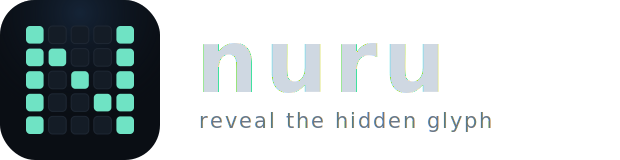

<p align="center">
  
</p>

<p align="center">
  <b><a href="https://dnakitare.github.io/nuru/">Play the daily →</a></b>
</p>

**Nuru** is a daily logic puzzle. A glyph is hidden on an 8×8 grid; you light the
right cells to uncover it. Every board is solvable by pure deduction, so you
never have to guess. ("Nuru" is Swahili for *light*.)

## How to play

- **Edge numbers** count the lit cells in that row or column (like picross).
- **`=`** joins two cells that share a state: both lit, or both dark.
- **`≠`** joins two cells that differ: one lit, one dark.
- Tap a cell to cycle **unknown → lit → dark**. Solve the grid and the glyph appears.

The `=` / `≠` links are what make it more than picross. They let the generator
build a unique, no-guess puzzle for any glyph without pre-revealing a single
cell, so the reveal is always a surprise.

## Under the hood

Nuru runs on a small deduction engine (`src/core`, `src/solver`, `src/gen`): a
propositional constraint solver that guarantees every generated board has a
single solution reachable by logic alone. The grid, the picture, the difficulty
rating, and the hint system are all the same constraint graph. The engine has
zero DOM dependencies; the browser game imports it, never the reverse.

```
src/core/     constraint model, registry, wire format, canonical hash
src/solver/   deduction-only solver + certificate
src/gen/      glyph library, seeded generator, difficulty grading
src/web/      the game (renderer, input, share card)
cli/          gen | grade | verify | trace | batch  (engine dev tools)
```

## Develop

```
npm install
npm run dev          # local dev server
npm test             # unit + property tests
npm run typecheck
npm run build:web    # production build → dist/
```

## License

MIT. See [LICENSE](LICENSE).
